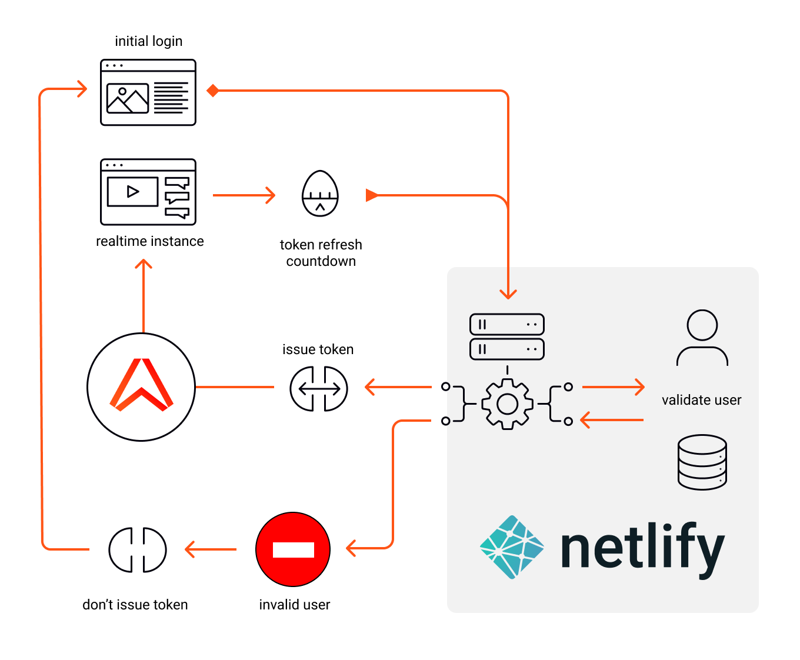

# Netlify Identity & JWT authentication


## Description

This article shows you how to set up token authentication with very little effort. We will make an endpoint using a [Netlify function](https://docs.netlify.com/functions/overview/) that lets you do this.

```javascript
const authUrl = ".netlify/functions/ably-jwt?id={user-id}";
const ably = new Ably.Realtime({ authUrl });
```

Then we will use [Netlify Identity]([Authenticate users with Netlify Identity | Netlify Docs](https://docs.netlify.com/visitor-access/identity/)) to register and moderate users, giving our app that extra level of security and an easy way to ban bad actors on our app.

## What you'll need

1. An Ably API Key, sign up for a [free account](https://ably.com/sign-up)
2. A [Netlify](https://netlify.com) account to host and manage your registered users.
3. A [GitHub](https://github.com) account is required to link Netlify to the repository.

# Overview of architecture

In our example app, a new user needs to register and confirm their email address to activate themselves before they can log in. At login, we validate them with Netlify Identity and check that they have not been flagged as **Banned**. Bad actors are not issued with a JWT token. Valid users are issued a token, to authenticate with Ably, and the auth URL carries their unique ID within it.



*(1) User logs-in (2) Check user identity - valid users get JWT token and continue to the app, and invalid users are rejected (3) use the token, wait for it to expire then repeat.*

## Initial steps

1. Fork this repository
2. Use Netlify dashboard to create a new project, and select your fork as the source.
3. Activate the Netlify identity services on the Identity section.
4. Add the environment variables to the new Netlify app from the site settings section, under `Build & deploy`
5. Deploy the website, visit the homepage and sign-up as a new user.
6. Log-in with the confirmed user and you'll be able to connect to Ably realtime.

If you get stuck or need more detailed explanation please [see the blog post](https://ably.com/blog/netlify-indentit-jwt/).

## Environment variables

For the JWT endpoint to work you will need to add **environment variables**. From the dashboard navigate to your app instance then: **Site settings** > **Build & Deploy** > **Environment**. There you click `Edit variables` and input the values below.

| **Key**         | **Type**       | **Description**                                                  |
| --------------- | -------------- | ---------------------------------------------------------------- |
| ABLY_APIKEY     | String         | The API key of your Ably App                                     |
| ABLY_CAPABILITY | String or Null | JSON string of permissions e.g. `{"channel-name":["subscribe"]}` |
| ABLY_TTLSECONDS | Number         | Refresh rate in seconds e.g. 3600 (60sec)                        |

**Capability** is related to the Ably APP permissions.

You might want to limit operations to _subscribe_ only. To refine permissions please refer to our documentation: [capabilities explained](https://ably.com/documentation/core-features/authentication#capabilities-explained). In this example `{"channel-name": ["subscribe", "publish"]}` means the status channel has _publish_ and _subscribe_ permission.

## Register a new user to your app

At this point your setup is complete, and you can start adding users. Open the Netlify website and use the sign-up link to add a user. This will trigger an email confirmation and when that is complete your new user will be able to login and connect to the Ably realtime network.

## Banning a User from connecting

Lets us pretend that one of your registered users needs to be banned. We can do this by modifying their account metadata, and assigning a role of `Banned`

1. Log-in to the Netlify dashboard for your app.
2. Go to the `Identity` section, and select a User account.
3. Edit the User metadata, and add the string `Banned` to the role and save.
4. Then return to the website, login as that user and click connect.

This will cause the authentication  to fail, the JWT will not be issued to that User and display an error message.

Conversely you can reverse the ban by clearing the assigned role.

## Running localhost

The majority of the Netlify functionality can be reproduced locally by using the [Netlify CLI](https://docs.netlify.com/cli/get-started/) tool. However the Identity features will not behave as expected when using local development server. This is a known constraint and Identity functionality requires the production server.

To start a development server on localhost, to test your serverless functions:

```bash
$ netlify dev
```

## Contributing

We have a [contributing guide](CONTRIBUTING.md) that explains how to contribute to this repository.

---
 [Ably on Twitter](https://twitter.com/ablyrealtime) | [Ably SDKs](https://github.com/ably/) | [Ably.com](https://ably.com) | [Sign-up for free](https://ably.com/signup)
